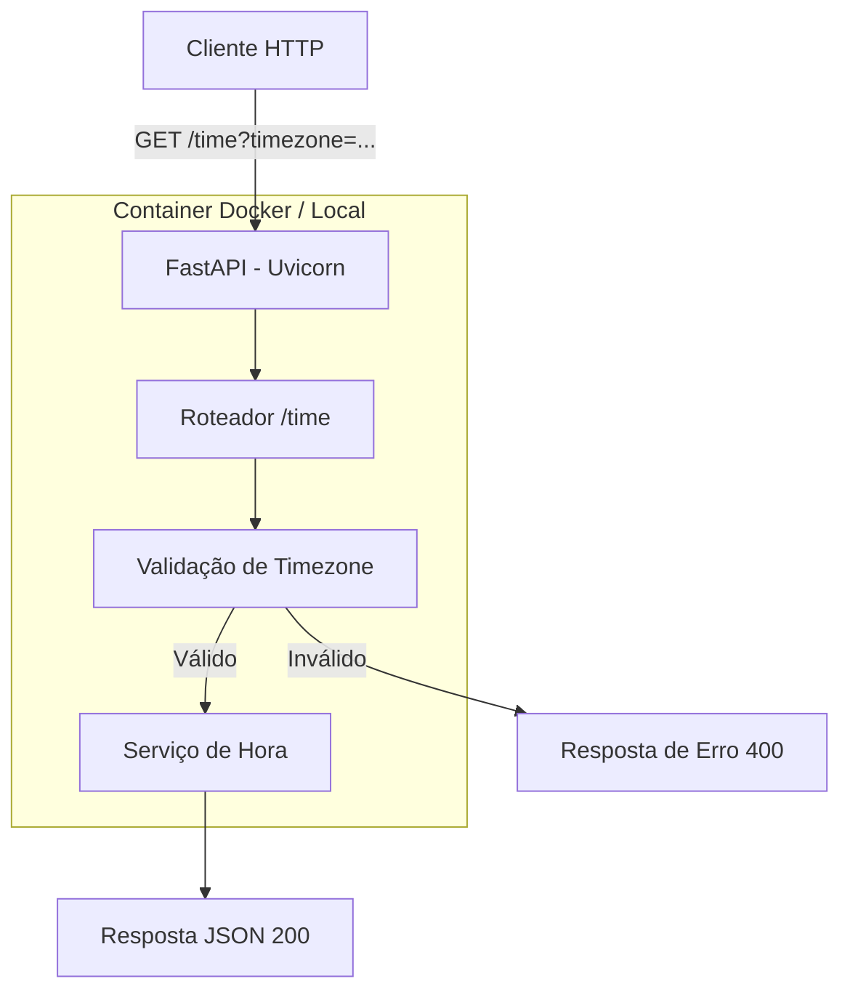

# Design Document — time-service

## Overview

O **time-service** é uma aplicação web minimalista construída com Python e FastAPI que expõe um único endpoint `GET /time` para consulta do horário atual em qualquer zona horária IANA. Quando nenhuma zona horária é informada, utiliza-se "America/Sao_Paulo" (UTC-3) como padrão.

A aplicação é projetada para ser leve, de fácil implantação (local via uvicorn ou em container Docker) e com documentação automática via Swagger UI.

### Decisões de Design

| Decisão | Justificativa |
|---------|---------------|
| **Python 3.14t** (free-threaded) | Versão mais recente com suporte a free-threading (sem GIL), melhor performance em cenários concorrentes |
| **uv** como gerenciador de pacotes/venv | Extremamente rápido, substitui pip/venv, escrito em Rust, resolve dependências de forma determinística |
| **FastAPI** como framework | Tipagem nativa com Pydantic, documentação automática (Swagger/OpenAPI), alta performance com ASGI |
| **zoneinfo** (stdlib) para fusos | Elimina dependência externa (pytz), faz parte da biblioteca padrão |
| **Pydantic** para modelos de resposta | Validação e serialização automática, integração nativa com FastAPI |
| **Imagem Docker slim** | Menor tamanho de imagem, deploy mais rápido |
| **Porta 8000** como padrão | Convenção padrão do uvicorn |

## Architecture



### Estrutura de Diretórios

```
exemplo_cli/
├── app/
│   ├── __init__.py
│   ├── main.py          # Instância FastAPI + configuração
│   ├── routers/
│   │   ├── __init__.py
│   │   └── time.py      # Endpoint GET /time
│   ├── schemas/
│   │   ├── __init__.py
│   │   └── time.py      # Modelos Pydantic de request/response
│   └── services/
│       ├── __init__.py
│       └── time.py      # Lógica de negócio (obter hora por timezone)
├── tests/
│   ├── __init__.py
│   ├── test_time_endpoint.py
│   └── test_time_service.py
├── Dockerfile
├── pyproject.toml       # Dependências e metadados do projeto (gerenciado por uv)
└── README.md
```

## Components and Interfaces

### 1. Módulo Principal (`app/main.py`)

Responsável por criar a instância FastAPI e registrar os roteadores.

```python
from fastapi import FastAPI
from app.routers import time

app = FastAPI(
    title="Time Service",
    description="Serviço de consulta de horário atual com suporte a zonas horárias IANA",
    version="1.0.0",
)

app.include_router(time.router)
```

### 2. Roteador de Tempo (`app/routers/time.py`)

Expõe o endpoint `GET /time` e delega a lógica ao serviço.

```python
from fastapi import APIRouter, Query
from app.schemas.time import TimeResponse, ErrorResponse
from app.services.time import get_current_time

router = APIRouter()

@router.get(
    "/time",
    response_model=TimeResponse,
    responses={400: {"model": ErrorResponse}},
)
async def get_time(timezone: str = Query(default="", description="Zona horária IANA")):
    ...
```

### 3. Serviço de Tempo (`app/services/time.py`)

Contém a lógica pura de obtenção do horário e formatação.

**Interface:**

```python
def get_current_time(timezone_str: str) -> dict:
    """
    Retorna a hora atual para a zona horária informada.
    
    Args:
        timezone_str: Identificador IANA (ex: "America/Sao_Paulo").
                      Se vazio, usa "America/Sao_Paulo" como padrão.
    
    Returns:
        dict com campos: datetime, timezone, utc_offset
    
    Raises:
        InvalidTimezoneError: se a zona horária não for válida
    """
```

### 4. Validação de Timezone (`app/services/time.py`)

```python
import re

TIMEZONE_PATTERN = re.compile(r'^[A-Za-z0-9_/\-]{1,64}$')
DEFAULT_TIMEZONE = "America/Sao_Paulo"

def validate_timezone(timezone_str: str) -> str:
    """
    Valida o formato e existência da zona horária.
    
    Retorna a timezone normalizada ou levanta InvalidTimezoneError.
    """
```

### 5. Schemas Pydantic (`app/schemas/time.py`)

```python
from pydantic import BaseModel

class TimeResponse(BaseModel):
    datetime: str    # ISO 8601 com offset (ex: "2024-01-15T14:30:00-03:00")
    timezone: str    # Identificador IANA (ex: "America/Sao_Paulo")
    utc_offset: str  # Formato ±HH:MM (ex: "-03:00")

class ErrorResponse(BaseModel):
    detail: str      # Mensagem descritiva do erro
```

## Data Models

### Resposta de Sucesso (HTTP 200)

| Campo | Tipo | Formato | Exemplo |
|-------|------|---------|---------|
| `datetime` | string | ISO 8601 com offset | `"2024-01-15T14:30:00-03:00"` |
| `timezone` | string | Identificador IANA | `"America/Sao_Paulo"` |
| `utc_offset` | string | `±HH:MM` | `"-03:00"` |

### Resposta de Erro (HTTP 400)

| Campo | Tipo | Exemplo |
|-------|------|---------|
| `detail` | string | `"Zona horária inválida: 'Invalid/Zone'"` |

### Regras de Negócio

1. **Timezone padrão**: Se `timezone` é omitido ou vazio → utiliza `"America/Sao_Paulo"`
2. **Validação de formato**: Regex `^[A-Za-z0-9_/\-]{1,64}$` — permite apenas letras, números, underscores, hífens e barras, com máximo de 64 caracteres
3. **Validação de existência**: Após validar formato, verifica se o identificador existe na base IANA via `zoneinfo.ZoneInfo`
4. **Formato datetime**: `datetime.now(tz).isoformat()` com precisão de segundos (sem microsegundos)
5. **Formato utc_offset**: Extraído do offset do datetime no formato `±HH:MM`


## Correctness Properties

*Uma propriedade é uma característica ou comportamento que deve se manter verdadeiro em todas as execuções válidas de um sistema — essencialmente, uma declaração formal sobre o que o sistema deve fazer. Propriedades servem como ponte entre especificações legíveis por humanos e garantias de corretude verificáveis por máquina.*

### Property 1: Timezone válida produz resposta estruturada correta

*Para qualquer* identificador IANA de zona horária válido (retirado da base de dados IANA), ao consultar `GET /time?timezone={tz}`, a resposta SHALL ter status HTTP 200 e conter exatamente 3 campos: `datetime` no formato ISO 8601 com precisão de segundos e offset (regex: `^\d{4}-\d{2}-\d{2}T\d{2}:\d{2}:\d{2}[+-]\d{2}:\d{2}$`), `timezone` igual ao identificador informado, e `utc_offset` no formato `±HH:MM` (regex: `^[+-]\d{2}:\d{2}$`).

**Validates: Requirements 1.1, 1.2, 4.2, 4.3, 4.4, 4.6**

### Property 2: Timezone inválida produz erro com valor informado

*Para qualquer* string que não seja um identificador IANA válido (seja por conter caracteres não permitidos, exceder 64 caracteres, ou simplesmente não existir na base IANA), ao consultar `GET /time?timezone={valor}`, a resposta SHALL ter status HTTP 400, conter o campo `detail` como string, e esse campo SHALL conter o valor inválido que foi informado no parâmetro.

**Validates: Requirements 3.1, 3.2, 3.3, 4.5**

### Property 3: Consistência entre utc_offset e datetime

*Para qualquer* zona horária IANA válida, o valor do campo `utc_offset` na resposta SHALL ser idêntico ao offset presente no final do campo `datetime` (os últimos 6 caracteres no formato `±HH:MM`). Isso garante que ambos os campos são derivados da mesma fonte de dados e são mutuamente consistentes.

**Validates: Requirements 1.2, 4.2, 4.4**

## Error Handling

| Cenário | Status HTTP | Corpo da Resposta |
|---------|-------------|-------------------|
| Timezone válida | 200 | `{"datetime": "...", "timezone": "...", "utc_offset": "..."}` |
| Timezone inválida (formato incorreto) | 400 | `{"detail": "Zona horária inválida: '{valor}'"}` |
| Timezone inválida (não existe na IANA) | 400 | `{"detail": "Zona horária inválida: '{valor}'"}` |
| Timezone vazia ou omitida | 200 | Resposta com timezone="America/Sao_Paulo" |

### Estratégia de Tratamento

1. **Validação em camadas**: Primeiro valida o formato (regex), depois a existência na base IANA
2. **Exceção customizada**: `InvalidTimezoneError` capturada por exception handler do FastAPI
3. **Mensagem informativa**: Inclui o valor inválido na mensagem para facilitar debug pelo consumidor
4. **Fail-fast**: Erros de validação retornam imediatamente sem processamento adicional

```python
from fastapi import HTTPException

class InvalidTimezoneError(Exception):
    def __init__(self, timezone: str):
        self.timezone = timezone
        self.message = f"Zona horária inválida: '{timezone}'"

# Exception handler registrado no FastAPI
@app.exception_handler(InvalidTimezoneError)
async def invalid_timezone_handler(request, exc):
    return JSONResponse(
        status_code=400,
        content={"detail": exc.message}
    )
```

## Testing Strategy

### Abordagem Dual

O projeto utiliza uma abordagem combinada de testes unitários (exemplos específicos) e testes baseados em propriedades (verificação universal).

### Testes Unitários (pytest)

Focam em cenários específicos e casos de borda:

| Teste | Tipo | Descrição |
|-------|------|-----------|
| Timezone omitida → padrão | EXAMPLE | Verifica que sem timezone retorna America/Sao_Paulo |
| Timezone vazia → padrão | EXAMPLE | Verifica que `?timezone=` retorna America/Sao_Paulo |
| Resposta ≤ 500ms | INTEGRATION | Mede tempo de resposta sem timezone |
| Porta 8000 ocupada → erro | EXAMPLE | Verifica mensagem de erro ao iniciar com porta em uso |
| GET /docs → Swagger | EXAMPLE | Verifica que /docs retorna HTML com status 200 |
| GET /openapi.json → schema | EXAMPLE | Verifica que /openapi.json é válido e contém /time |
| Content-Type correto | EXAMPLE | Verifica application/json nas respostas |

### Testes Baseados em Propriedades (Hypothesis)

**Biblioteca**: [Hypothesis](https://hypothesis.readthedocs.io/) — a biblioteca de referência para PBT em Python.

**Configuração**:
- Mínimo de 100 iterações por propriedade (`@settings(max_examples=100)`)
- Cada teste referencia a propriedade do design document via tag

**Testes de Propriedade:**

| Tag | Propriedade | Estratégia de Geração |
|-----|-------------|----------------------|
| `Feature: time-service, Property 1: Valid timezone produces correct structured response` | Timezone válida → resposta com 3 campos corretos | `st.sampled_from(available_timezones())` — seleciona timezones aleatórias da base IANA |
| `Feature: time-service, Property 2: Invalid timezone produces error with value` | Timezone inválida → 400 com detail contendo valor | `st.text()` filtrado para excluir timezones IANA válidas, combinado com `st.text(min_size=65)` para strings longas |
| `Feature: time-service, Property 3: utc_offset consistency with datetime` | utc_offset = offset do datetime | `st.sampled_from(available_timezones())` — verifica consistência interna da resposta |

### Testes Smoke (Docker)

| Teste | Descrição |
|-------|-----------|
| Build Docker | `docker build` completa sem erro |
| Run Docker | Container responde em /time na porta 8000 |
| Startup local | `uvicorn` inicia e responde em ≤ 10s |

### Ferramentas e Execução

- **Runtime**: Python 3.14t (free-threaded)
- **Gerenciador de pacotes/venv**: uv
- **Framework de teste**: pytest
- **PBT**: hypothesis
- **HTTP Client**: httpx (TestClient do FastAPI para testes unitários)
- **Criar venv**: `uv venv --python 3.14t`
- **Instalar dependências**: `uv pip install -e ".[dev]"`
- **Execução de testes**: `uv run pytest tests/ -v`
- **Cobertura**: `uv run pytest --cov=app tests/`
