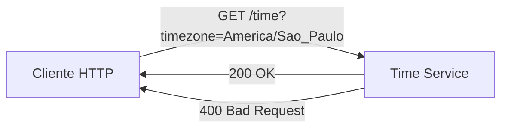
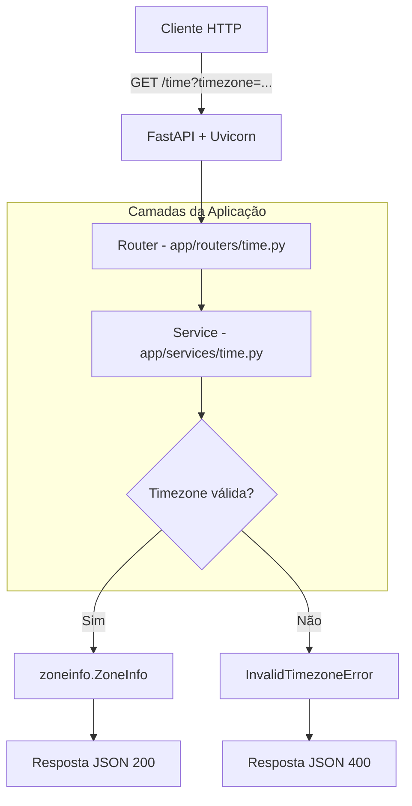
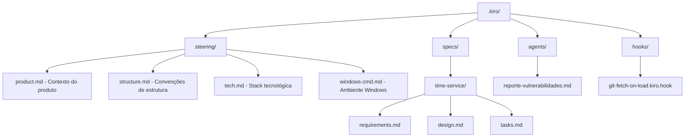
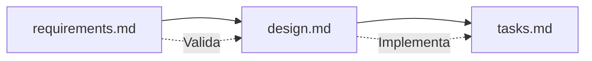
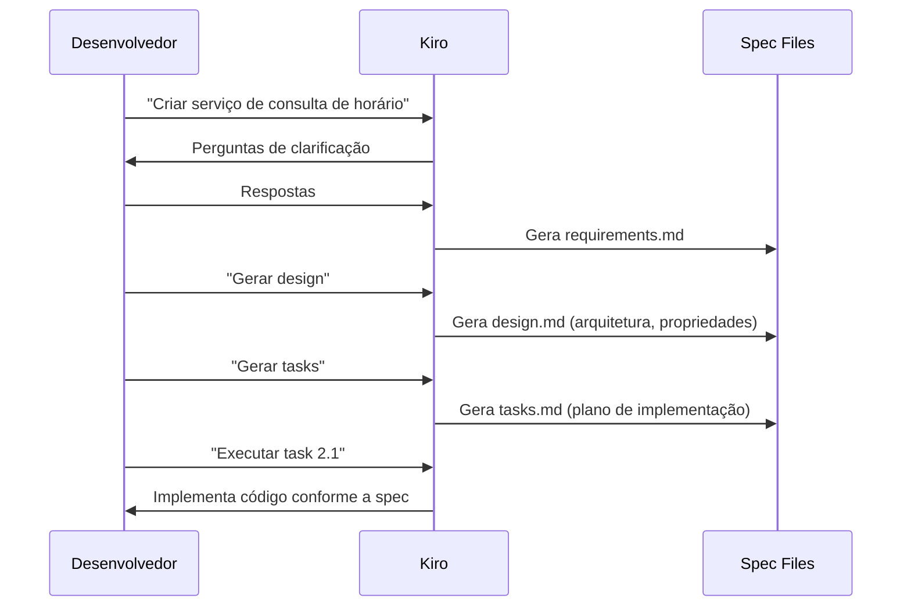
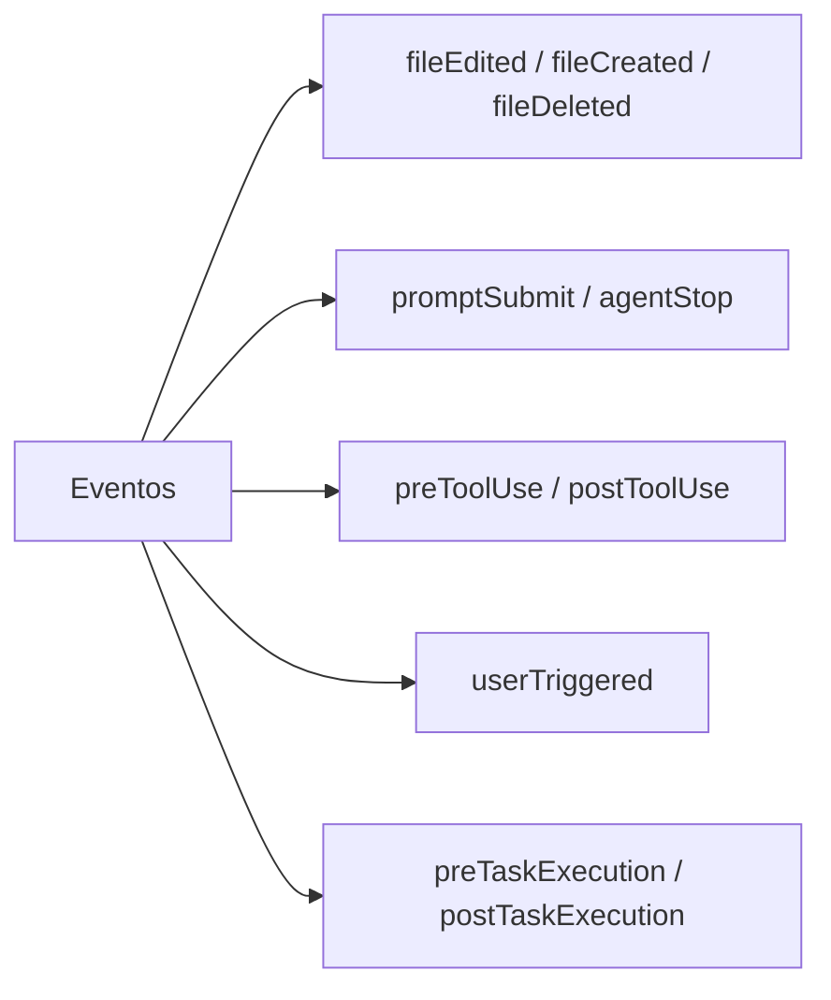
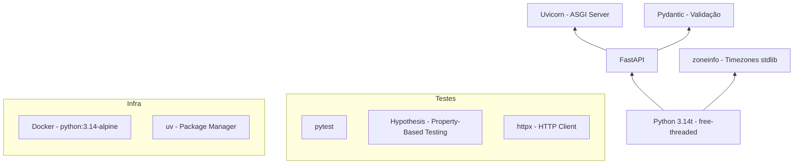

# ⏰ Time Service — Exemplo de Projeto com Kiro

API REST minimalista que retorna a hora atual em qualquer zona horária IANA, construída com **Python 3.14** e **FastAPI**. Este repositório serve como **exemplo prático de uso do [Kiro](https://kiro.dev)** — demonstrando specs, steering files, hooks e agents.

## Visão Geral



**Endpoint único:** `GET /time?timezone=<IANA_ID>`

| Parâmetro | Tipo | Padrão | Descrição |
|-----------|------|--------|-----------|
| `timezone` | query string | `America/Sao_Paulo` | Identificador IANA de zona horária |

**Resposta de sucesso (200):**

```json
{
  "datetime": "2026-07-17T10:30:00-03:00",
  "timezone": "America/Sao_Paulo",
  "utc_offset": "-03:00"
}
```

**Resposta de erro (400):**

```json
{
  "detail": "Zona horária inválida: 'Invalid/Zone'"
}
```

---

## Arquitetura



### Estrutura do Projeto

```
exemplo_cli/
├── app/
│   ├── main.py             # Instância FastAPI + exception handlers
│   ├── routers/
│   │   └── time.py         # Endpoint GET /time
│   ├── schemas/
│   │   └── time.py         # Modelos Pydantic (TimeResponse, ErrorResponse)
│   └── services/
│       └── time.py         # Lógica de negócio (validação + obtenção de hora)
├── tests/
│   └── test_final_validation.py
├── .kiro/                  # ⭐ Configurações Kiro (detalhes abaixo)
├── Dockerfile
├── pyproject.toml
└── uv.lock
```

---

## ⭐ Kiro em Ação

A pasta `.kiro/` é onde toda a mágica do Kiro acontece. Ela contém as instruções, especificações e automações que guiam o desenvolvimento assistido por IA.



---

### 📋 Steering Files (`.kiro/steering/`)

Steering files fornecem contexto persistente ao Kiro em todas as interações. São incluídos automaticamente (por padrão) ou condicionalmente.

| Arquivo | Propósito |
|---------|-----------|
| `product.md` | Descreve o que é o produto, funcionalidade core, usuários-alvo e padrões de qualidade |
| `structure.md` | Convenções de arquitetura (routers → schemas → services), como adicionar endpoints |
| `tech.md` | Stack tecnológica (Python 3.14, FastAPI, uv, pytest, hypothesis) |
| `windows-cmd.md` | Instruções para ambiente Windows CMD (comandos nativos, ativação de venv) |

**Como funciona:** Toda vez que o Kiro processa uma mensagem, ele lê esses arquivos para entender o contexto do projeto. Isso garante consistência — não importa qual pergunta seja feita, o Kiro sabe que este projeto usa `uv`, escreve docstrings em pt-BR e segue a separação de camadas.

**Exemplo de uso (inclusion: auto):**

```yaml
---
inclusion: auto
---

# Tech Stack
- Python 3.14 (free-threaded)
- FastAPI + Pydantic
- uv como gerenciador de pacotes
```

---

### 📐 Specs (`.kiro/specs/time-service/`)

Specs representam o fluxo **Spec-Driven Development** do Kiro. Um feature é especificado em três documentos que evoluem juntos:



| Documento | Conteúdo |
|-----------|----------|
| `requirements.md` | User stories, critérios de aceitação (formato EARS), glossário |
| `design.md` | Arquitetura, componentes, modelos de dados, propriedades de corretude, estratégia de testes |
| `tasks.md` | Plano de implementação com tarefas incrementais, dependências e checkpoints |

**Fluxo de trabalho:**



**Propriedades de corretude** definidas no `design.md`:

1. Timezone válida → resposta com 3 campos nos formatos corretos
2. Timezone inválida → erro 400 com o valor informado no campo `detail`
3. `utc_offset` é sempre consistente com o offset presente no `datetime`

---

### 🤖 Custom Agents (`.kiro/agents/`)

Agentes customizados permitem criar "especialistas" sob demanda para tarefas recorrentes.

| Agente | Descrição |
|--------|-----------|
| `reporte-vulnerabilidades.md` | Analisa o código do projeto em busca de vulnerabilidades de segurança, gera relatório categorizado por severidade e fornece pontuação de 0 a 100 |

**Como usar:** Basta invocar o agente no chat do Kiro. Ele escaneia todos os arquivos do projeto e gera um relatório formatado com achados classificados em Crítico, Alto, Médio e Baixo.

---

### ⚡ Hooks (`.kiro/hooks/`)

Hooks automatizam ações baseadas em eventos do IDE.

| Hook | Evento | Ação |
|------|--------|------|
| `git-fetch-on-load.kiro.hook` | `userTriggered` (manual) | Executa `git fetch --all` |

**Tipos de eventos disponíveis:**



---

## Como Rodar

### Pré-requisitos

- [Python 3.14](https://www.python.org/downloads/) (free-threaded)
- [uv](https://docs.astral.sh/uv/getting-started/installation/) — gerenciador de pacotes

### Instalação Local

```bash
# Criar virtual environment
uv venv --python 3.14t

# Ativar venv (Windows CMD)
.venv\Scripts\activate

# Instalar dependências
uv pip install -e ".[dev]"

# Rodar o serviço
uv run uvicorn app.main:app --reload
```

O serviço estará disponível em `http://localhost:8000`

### Docker

```bash
# Build
docker build -t time-service .

# Run
docker run -p 8000:8000 time-service
```

### Testar

```bash
# Executar testes
uv run pytest tests/ -v

# Com cobertura
uv run pytest --cov=app tests/
```

---

## Endpoints

| Método | Path | Descrição |
|--------|------|-----------|
| GET | `/time` | Hora atual (padrão: America/Sao_Paulo) |
| GET | `/time?timezone=US/Eastern` | Hora atual em zona horária específica |
| GET | `/docs` | Swagger UI (documentação interativa) |
| GET | `/openapi.json` | Schema OpenAPI |

---

## Stack Tecnológica



---

## Licença

Este projeto é um exemplo educacional de uso do Kiro para desenvolvimento assistido por IA.
